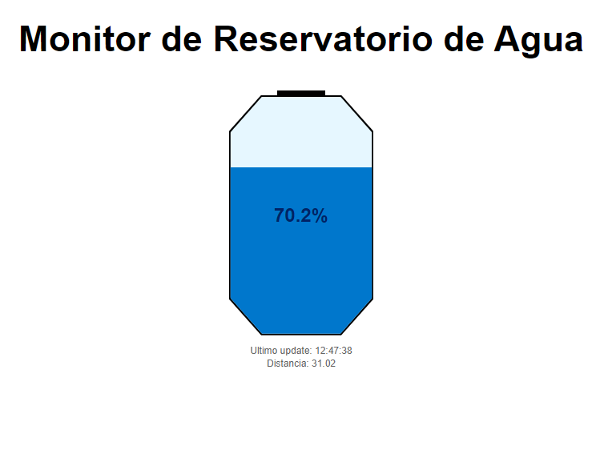

# Wifi Water Level Monitor
This project implements a water level monitor for an ESP32-C3 SuperMini and an HC-SR04 ultrasonic sensor. The device serves a live dashboard, stores one averaged minute record, and retains up to 30 rolling days in LittleFS.

Copy `config.h.example` to `config.h`, set the Wi-Fi credentials and distance calibration, then select an ESP32-C3 board in the Arduino IDE. The default ultrasonic pins are GPIO 4 (trigger) and GPIO 5 (echo); both can be overridden in `config.h`. The HC-SR04 echo signal must be reduced to 3.3 V before connecting it to the ESP32-C3.

The dashboard exposes `/api/current`, `/api/history`, and `/download` in addition to `/`. History timestamps and CSV exports are UTC Unix timestamps; the browser renders graph and update labels in local time.

## Webpage
The following is a screenshot of the webpage served by the ESP8266.

