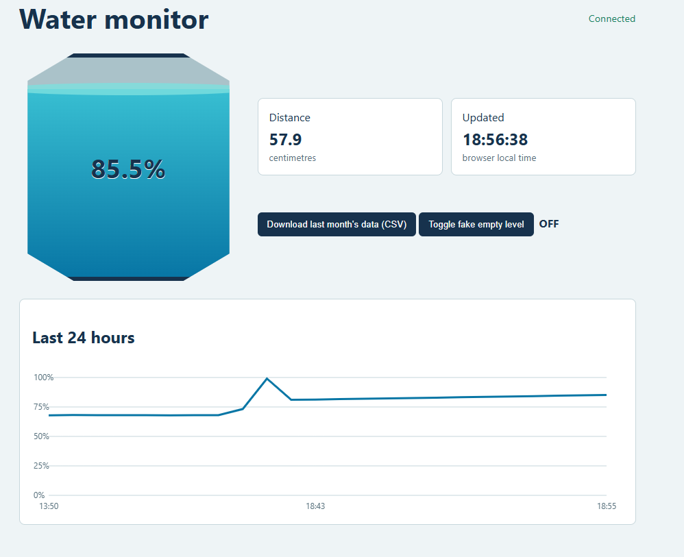

# Water Level Monitoring System
This project implements a water level monitor and relay control system for refilling a water tank upon need using a multi-point architecture on a LAN. 

The water level is measured using an ultrasonic sensor (HC-SR04) connected to an ESP32-C3 microcontroller. The ESP32-C3 serves a web dashboard that displays the current water level and historical data, for user reference. It exposes an endpoint that allows users to control the relay, which can activate a water pump when the water level falls below a certain threshold.

## Onboarding

### Water Level Monitor

Copy `config.h.example` to `config.h`, set the Wi-Fi credentials and distance calibration, then select an ESP32-C3 board in the Arduino IDE. The default ultrasonic pins are GPIO 4 (trigger) and GPIO 5 (echo); both can be overridden in `config.h`. The HC-SR04 echo signal must be reduced to 3.3 V before connecting it to the ESP32-C3.

> A resistor voltage divider is a simple way to reduce the echo signal from 5 V to 3.3 V. Use a 1 kΩ resistor in series with the ECHO pin and a 2 kΩ resistor from the ECHO pin to ground.

The dashboard exposes `/api/current`, `/api/history`, and `/download` in addition to `/`. History timestamps and CSV exports are UTC Unix timestamps; the browser renders graph and update labels in local time.

A `fake empty level` button is made available on the dashboard for manually triggering a low water level event. This is useful for testing the relay control system without having to wait for the water level to drop naturally or in case the HCSR04 sensor is faulty or not installed.

### Relay Control

The relay control used in this project is a 5 V relay module that can be activated by the 3.3 V signal from an ESP32 board. The relay module has a separate 5 V power supply and an opto-isolated input, which allows it to be safely controlled by the ESP32-C3 without risking damage to the microcontroller.

Make sure that the IP address in `config.h` matches the IP address of the water level monitor on your local network. The relay control board will send HTTP requests to the water level monitor to get the current water level and decide whether to activate the relay.

## Remote firmware updates

The ESP32 supports authenticated OTA updates over the local network. Set `OTA_PASSWORD` in `config.h` to a strong, device-specific password, upload this version once over USB, and keep the board powered and connected to Wi-Fi.

Replace the value after `--auth=` with the value of `OTA_PASSWORD`. The board reboots automatically after a successful update. OTA is available only to devices that can reach the board on the local network; do not expose it directly to the internet.

### OTA rollback protection

After an OTA update, the new firmware remains pending for three minutes. Open the dashboard, choose **Keep this firmware**, and enter `OTA_PASSWORD` to confirm it. If confirmation does not arrive, the ESP32 marks the image invalid and reboots into the previous firmware automatically. This also protects against an image that boots but cannot provide a working OTA or dashboard service.

If the new image cannot boot far enough to run the application, the ESP32 bootloader's rollback support restores the previous image on reboot. Keep the previous firmware's OTA configuration and partition layout unchanged so the fallback image remains usable.

## Webpage
The following is a screenshot of the webpage served by the ESP8266.

