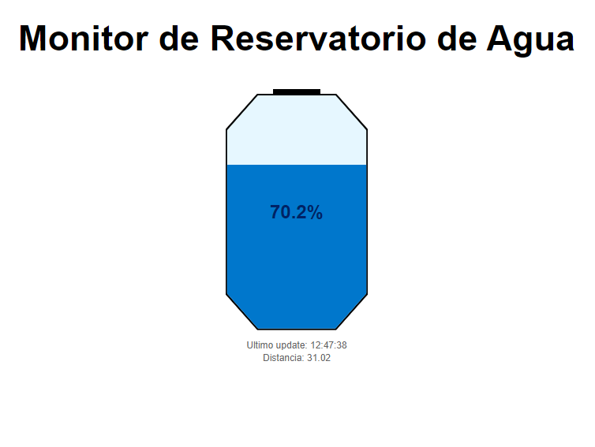

# Wifi Water Level Monitor
This project implements a water level monitor using an ESP8266 and an HCSR04 ultrasonic sensor. The water level is monitored and the microcontroller serves a webpage with the current data (updated every 5 seconds).

## Webpage
The following is a screenshot of the webpage served by the ESP8266.

